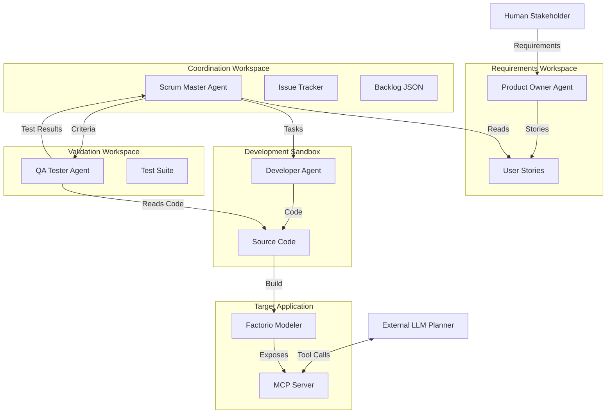
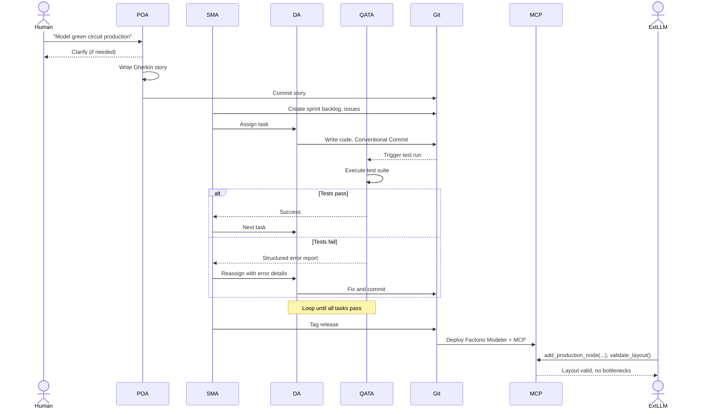

# Project Proposal: MAGE-Scrum
## Multi-Agent Generative Ecosystem for Automated Scrum-Driven Software Development

### 1. Goal of the Project

#### 1.1 High-Level Goal & Validation Strategy
Develop and evaluate an autonomous, role‑bounded Multi‑Agent System (MAS) that replicates an Agile Scrum team (Product Owner, Scrum Master, Developer, QA Tester) using **CrewAI**, **LangChain**, and **LangGraph**. The agents collaboratively build a **Factorio Modeler** – a full‑stack application that mathematically models, calculates, and connects *Factorio* production chains, and exposes a **Model Context Protocol (MCP)** server for external LLM tool‑calling.

**Why role isolation?** Monolithic code generation suffers from architectural drift and hallucinations. Strict role boundaries enforce bounded contexts, enable independent verification, and guarantee full auditability.

**Four Validation Criteria:**
1. **Workflow & Auditability**  
   - Automated GitHub issues, strict **Conventional Commits**, auto‑generated Markdown docs.  
   - **Zero boundary violations** – log analysis must confirm no agent performs out‑of‑role actions (e.g., Scrum Master never writes code).
2. **Functional Compliance**  
   - 100% mathematical accuracy for canonical Factorio production chains (10 itesms/min advanced circuit and a seperate 2,5 items/m express splitter layout).  
   - ≥90% automated test coverage generated independently by the QA Agent.
3. **MCP Usability**  
   - MCP server tools: `add_production_node`, `connect_nodes`, `calculate_throughput`, `validate_layout`.  
   - External LLM planner can build and validate a factory layout solely via tool calls.
4. **Human‑in‑the‑Loop**  
   - Measured quality of POA‑human dialogue: clarification efficiency, Gherkin story completeness, user satisfaction.

#### 1.2 System, Feature, and Workflow Framework
- **Product Owner Agent (POA)** – Converts rough human requirements into structured Gherkin user stories; never writes code.
- **Scrum Master Agent (SMA)** – Plans sprints, creates JSON backlog, assigns tasks, and handles failure re‑routing; never writes code or runs tests.
- **Developer Agent (DA)** – Works inside a Docker sandbox, writes code (Python/C#), and commits with Conventional Commits; cannot run tests.
- **QA Tester Agent (QATA)** – Independently generates and executes test suites in an isolated sandbox; only reports structured error logs to the SMA.

#### 1.3 AI Assistance & Tooling Infrastructure

| Development Stage | Agent(s) | Tooling & Infrastructure |
| :--- | :--- | :--- |
| Requirement Elicitation | POA | Chat interface, Gherkin processor, Markdown writer |
| Sprint Planning & Tasking | SMA | LangGraph state machine, GitHub Issues API, JSON backlog |
| Code Implementation | DA | Python/C#, Git CLI, Conventional Commits hooks |
| Validation & Testing | QATA | Pytest, output diff interceptor |
| MCP Server Implementation | DA | MCP SDK, integration test sandbox |
| MCP Validation | External LLM + QATA | MCP client, tool‑calling scripts, assertion framework |
| Human Review | Human + POA | Web‑based dialogue dashboard, acceptance log |

---

### 2. System and Architecture Diagrams

#### Diagram A: Infrastructure & Component Isolation
Strict unidirectional communication, enforced physical sandboxes, and an orchestration layer that manages agent lifecycles.

### Diagram B: Scrum Process & Information Flow
Lifecycle of a sprint from human request to deployment, including automatic bug‑fix loops.

### 3. Project Plan and Milestones

**8‑week timeline** (post‑approval):

#### Phase 1: Agent Architecture & Core Prompting
- **Task 1.1:** Build LangGraph multi‑agent backbone, global state trackers, and messaging topology.  
- **Task 1.2:** Develop system prompts with strict negative constraints (e.g., SMA declines code, DA cannot change scope).  
- *Milestone:* Agents exchange pre‑scripted messages without role violations; POA outputs correct Gherkin for 3+ Factorio features.

#### Phase 2: Sandbox Isolation & Git Tooling
- **Task 2.1:** Configure Docker containers for runtime execution, lock file permissions to enforce agent boundaries.  
- **Task 2.2:** Implement file‑system API bindings for the Developer, and command‑terminal interceptors for the QA Agent.  
- *Milestone:* DA builds a minimal Factorio Modeler skeleton inside a container; SMA auto‑creates GitHub issues with proper links.

#### Phase 3: State‑Machine Loop & Feedback Routing
- **Task 3.1:** Code state‑conditional logic for automatic feedback loops: QA failures → SMA reassignment → DA bug‑fix with retry limit.  
- *Milestone:* Complete autonomous sprint cycle for “green circuits” including at least one automated bug‑fix iteration without human intervention.

#### Phase 4: Evaluation, Audit & Finalization
- **Task 4.1:** Full‑lifecycle stress test: agents autonomously build a full‑stack Factorio Modeler with MCP interface.  
- **Task 4.2:** Run automated verification tools to audit role‑isolation compliance, clean artifacts, and write the final evaluation report.  
- *Milestone:* Zero role boundary violations; MCP‑driven external planner successfully designs an 10 itesms/min advanced circuit and a seperate 2,5 items/m express splitter layout; ≥90% test coverage.

---

### 4. Teamwork and Responsibilities

Workload evenly split between two members, each focusing on distinct technical layers.

**Fabian Rahofer – Multi‑Agent Intelligence & Orchestration**
- Architecture of CrewAI/LangChain orchestration and LangGraph state machine.
- Design & refinement of role‑specific system prompts (all agents).
- Human‑in‑the‑loop dialogue interface for the POA.
- LLM benchmarking and evaluation metrics.

**Hannes Zelger – Sandboxing, Tooling & Target Application**
- Docker sandbox construction with strict file‑permission isolation.
- Git/Commit automation (Conventional Commits, GitHub issue bot).
- Core Factorio Modeler application (domain logic, MCP server, tool definitions).
- QA test harness (execution, structured error reporting) and MCP integration tests.

Both members contribute to the final report and presentation.
